title: User Guide

# Introduction

Conductor for Gluent is an application to help manage Gluent offloads. The Gluent software works on a per database basis. Conductor has an additional unit above a database called a site. A particular installation of Conductor will have one site with one or more databases to manage. 

# Login
Enter the Conductor for Gluent Apex URL into your browser. The URL will be something of the form:

	http://{hostname}:{port}/apex/f?p=100

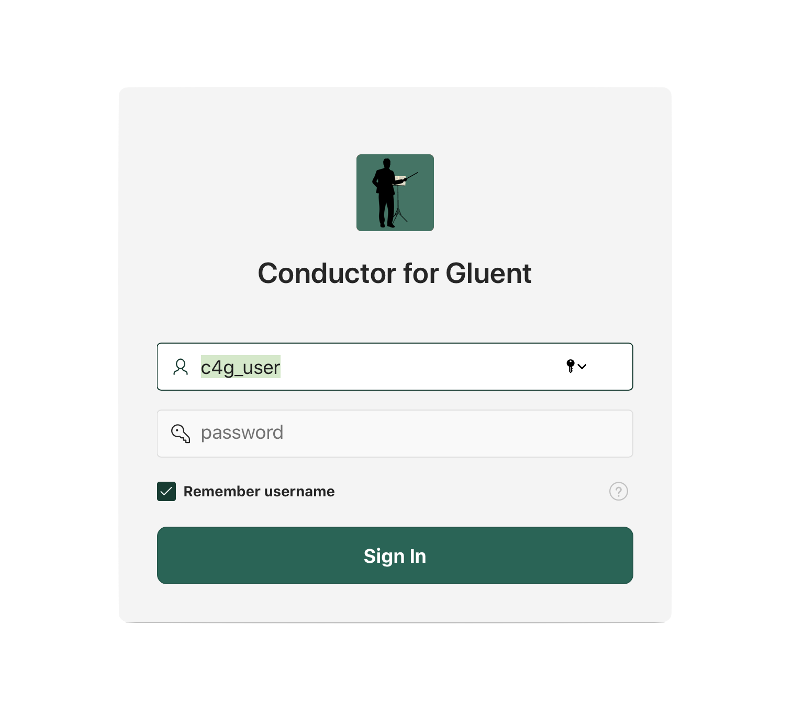

Once the Conductor for Gluent login form is available, then enter your username and password for Conductor for Gluent.

# Site

For Conductor, a site is made up of multiple databases.

## Site Home Page
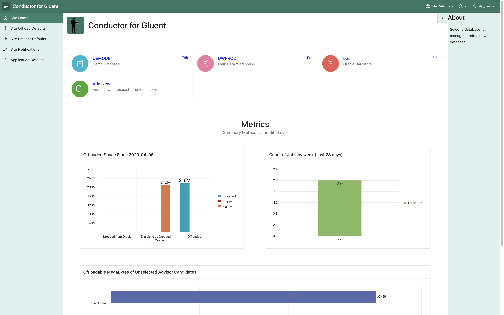

From the site home:

<ol>
<li>You can manage site level options:</li>
<ul>
<li>Default Offload Parameters</li>
<li>Default Present Parameters</li>
<li>Site Level Notification Options</li>
<li>Application Defaults</li>
</ul>
<li>Review metrics at the site level:</li>
<ul>
<li>Job Metrics</li>
<li>Amount of Data Offloaded</li>
<li>Amount of Space that hasn't been selected from the Gluent Advisor Report</li>
</ul>
<li>Add a New Database - Click on the <i>Add New</i> card from the list.</li>
<li>Select a Database to Manage - Click on one of the database cards, to manage it's jobs and tables.</li>
<li>Edit the details of a database - Click on the <i>Edit</i> Link of a database to change it's description, icon color, database link information, etc.</li>
</ol>

## Site Level Offload Parameters

Parameters listed here will be used for every offload command executed across all the databases. Any common or offload type parameter can be added; however, there are few parameters that you would want to apply to all of your offloads. The only example that I have come across was the use of the parameter "--count-star-expression".

## Site Level Present Parameters

Parameters listed here will be used for every present command across all the databases. Any common or present type parameter can be added; however, there are few parameters that you would want to apply to all of your present commands.

## Site Level Notifications Options
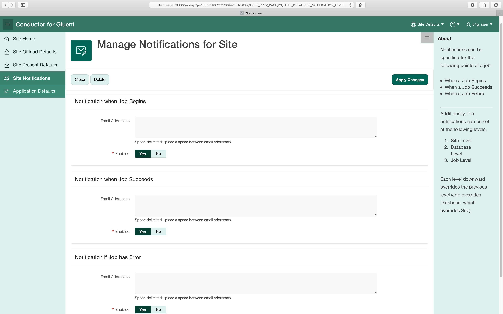

The implementation of notifications is different than that of parameters. For notifications, the job notifications override the database notifications which override the site notifications. Values entered at the site level will be used when there are no notifications at the database level and at the job level. Notifications are sent at the following points of a job:

- When Job Begins
- When Job Succeeds
- When Job has an Error

Notifications can be enabled and disabled.

## Site Level Application Defaults
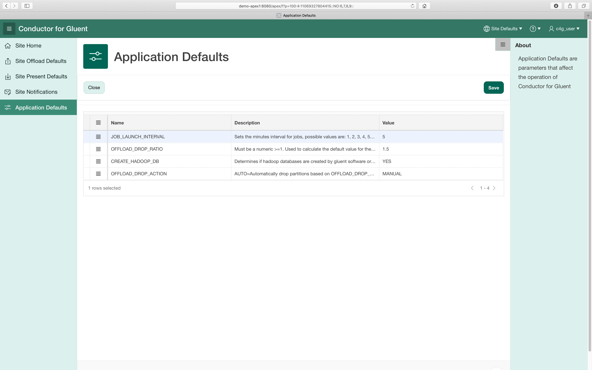

The application defaults are parameters that affect the way the Conductor for Gluent functions. Here is a list of the parameters and how they work:

- JOB_LAUNCH_INTERVAL – Controls the granularity of the drop down for minutes in the job scheduler. If set to 1, you can specify any minute of the hour (0-59). If you specify 15, you can specify 0, 15, 30, 45. 
- OFFLOAD_DROP_RATIO – Controls the default value for the DROP_THRESHOLD on tables. The value in this field will be multiplied with the OFFLOAD_THRESHOLD to determine the default for the DROP_THRESHOLD. 
- CREATE_HADOOP_DB – Controls whether the parameter –create-hadoop-db will be included on offload commands. If the Hadoop cluster allows the gluent user to create databases, then it should be set to YES. If the Hadoop cluster does not allow the gluent user to create databases, then set to NO. 
- OFFLOAD_DROP_ACTION – This is the site-wide default for whether an offload job step should attempt to
<ul>
<li>GENERATE : Generate a script to drop the offloaded partitions after an offload is completed based on Drop Threshold.</li>
<li>AUTO     : Drop the offloaded partitions after a table is offload based on Drop Threshold.</li>
<li>MANUAL   : Do Nothing after offload is completed.</li>
</ul>
The OFFLOAD_DROP_ACTION can be over-ridden at the table level.

# Database

## Database Home Page
After clicking on a database on the Site Home, you will go to the database home page for that particular database.

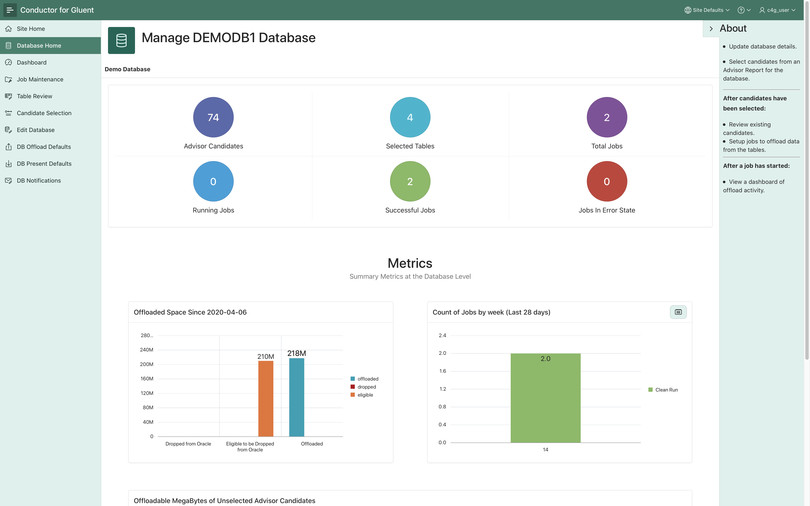

At the top of the screen it shows some summary information about the database:

- Advisor Candidates – # of tables in the advisor report that have not been selected for offload.
- Select Tables – # of tables that have been selected as candidates for offload.
- Total Jobs – # of jobs that have been created.
- Running Jobs – # of jobs currently running.
- Successful Jobs – # of jobs that completed successfully.
- Jobs in Error State – # of jobs where an error has occurred.

Below you will find metrics at the database level for the selected database:
<ul>
<li>Job Metrics</li>
<li>Amount of Data Offloaded</li>
<li>Amount of Space that hasn't been selected from the Gluent Advisor Report</li>
</ul>

From this page, the menu options expand to include access to:

- Dashboard
- Job Maintenance
- Table Review
- Candidate Selection
- Screen to Edit Database Details
- Screens to set offload, present and notification parameters at the database level

## Add/Edit Database
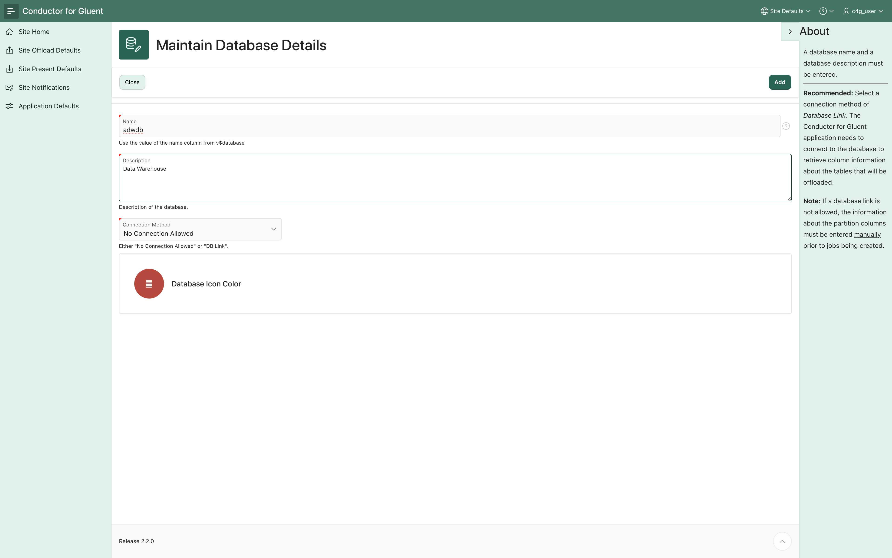

The database name, description and connection method can be specified on this screen. Then press Add button.
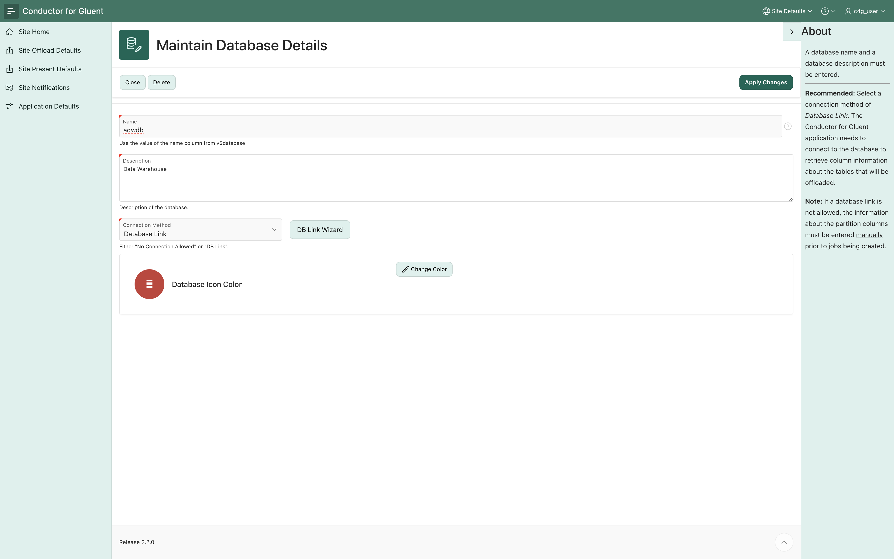

To update the database link information (if that is being used), is done by pressing on the DB Link Wizard button.

### DB Link Wizard – Step 1
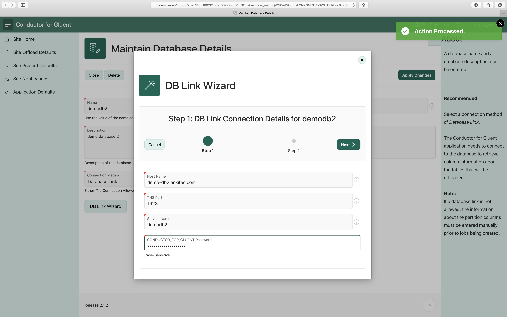

Enter the host name, port, service name, and password. Press Next to create the database link.

### DB Link Wizard – Step 2
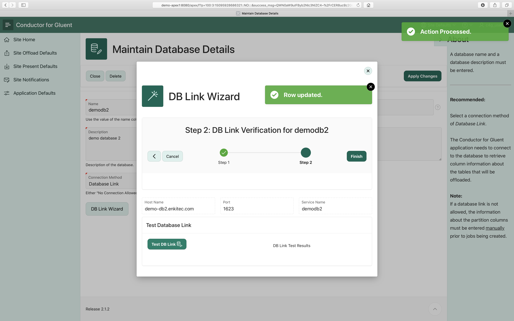

Press Test DB Link to verify that the database link is correct. Press Finish if the test is successful. Press the left arrow to go back and correct any of the database link information.

## DB Level Offload Parameters
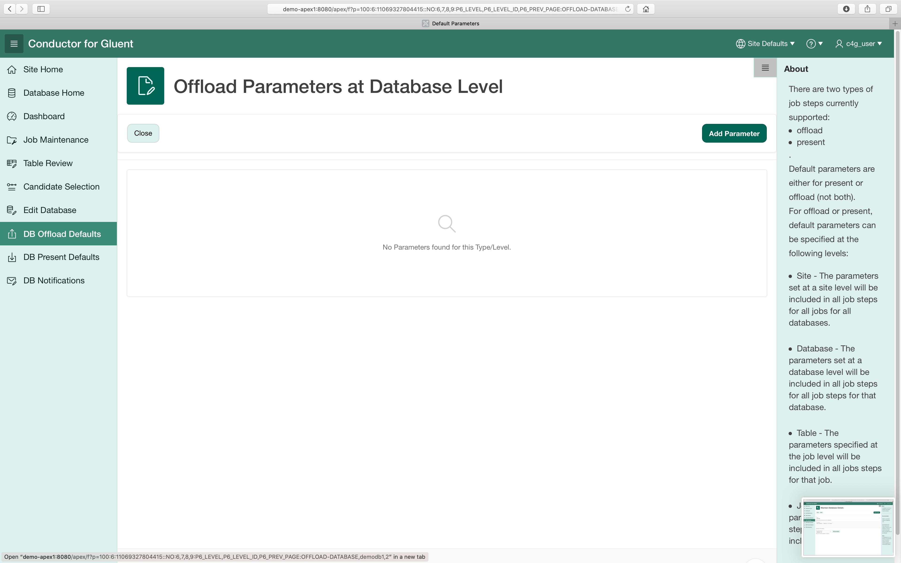

Parameters listed here will be used for every offload command executed for this database. Any common or offload type parameter can be added; however, there are few parameters that you would want to apply to all of your database offloads.

## DB Level Present Parameters
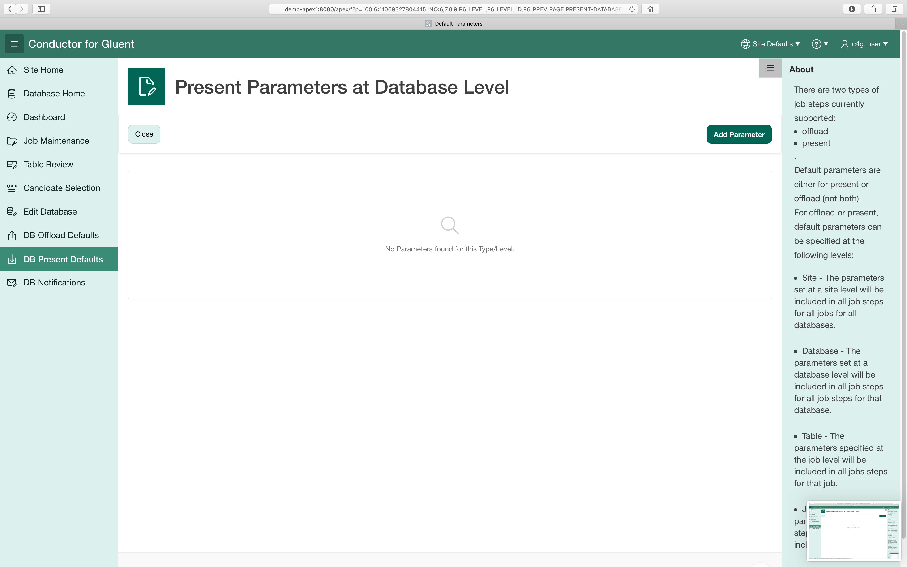

Parameters listed here will be used for every present command executed for this database. Any common or present type parameter can be added; however, there are few parameters that you would want to apply to all of your database present commands.

## DB Level Notifications Options

The implementation of notifications is different than that of parameters. For notifications, the job notifications override the database notifications which override the site notifications. Values entered at the database level will be used when there are no notifications at the job level. Notifications are sent at the following points of a job:

- When Job Begins 
- When Job Succeeds 
- When Job has an Error

Notifications can be enabled and disabled.

# Tables

## Candidate Selection Wizard
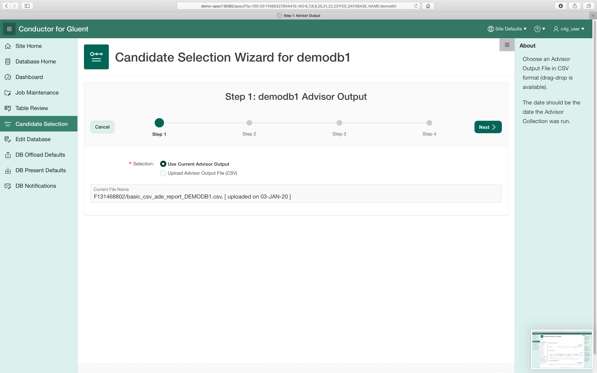

<u>Step 1 – Select an Advisor Output File</u>: 
Select a file or if this is your second time through, you can use the existing file. Multiple files can be uploaded if a new advisor report CSV is obtained. Press Next to continue.

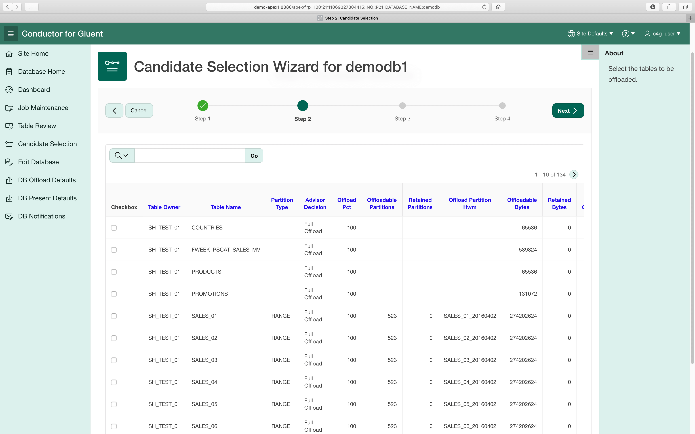

<u>Step 2 – Select Tables</u>: 
Select one or more tables that you want to offload. Press Next to continue.

<u>Step 3 – Table Thresholds</u>: 
The default offload threshold will be determined from the Advisor report. The drop threshold default will be calculated using the application parameter OFFLOAD_DROP_RATIO * offload threshold. Either threshold may be updated if desired. Press Next to continue.

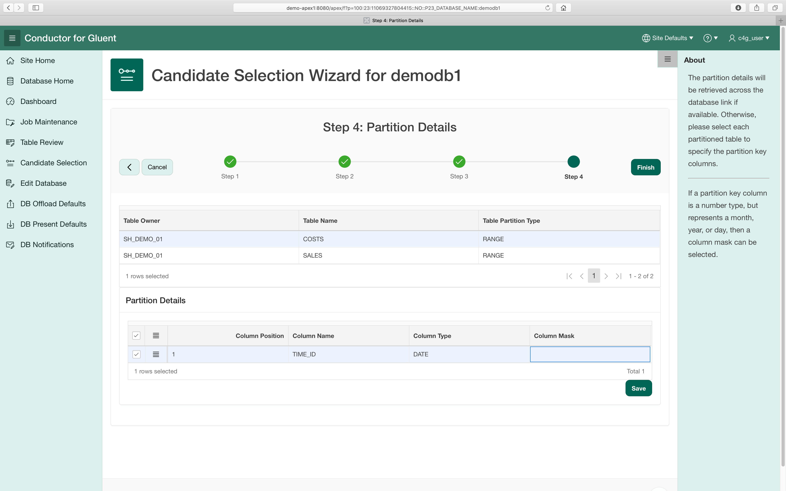

<u>Step 4 – Partition Details</u>: 
If a database link is in use, then the partition details will be automatically loaded from the database into the repository. If no connection is available, the partition details will need to be entered manually. Additionally, a column mask can be selected for numbers or strings that represent dates. Press Finish to complete the wizard.

## Table Review
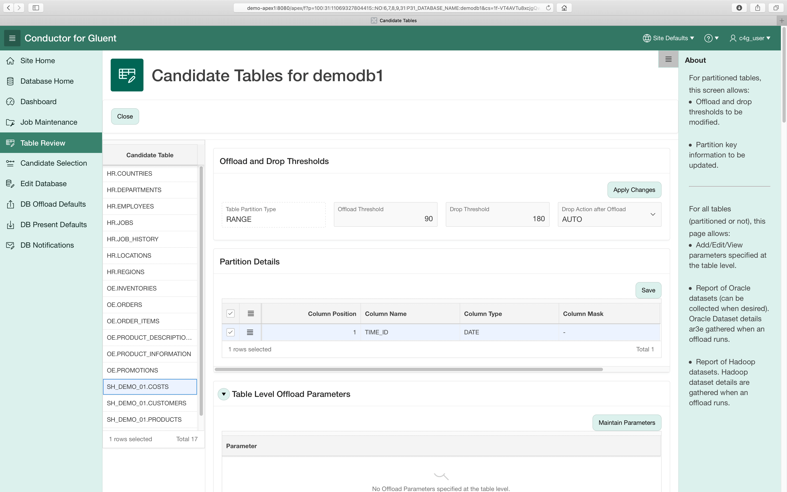

The table review screen allows you to add a new table and view information about the tables that have been selected to offload. The following details about tables are available:

For all tables, you can:

- View and Update table level offload parameters
- Review the Oracle Offload Datasets
- Review the Hadoop Offload Datasets

Additionally, for partitioned tables, you can:

- View and pdate the partition details
- View and update the offload and drop threshold, as well as, the offload drop action.

### Add Table Wizard
To add a new table, click the Add Table Wizard button.

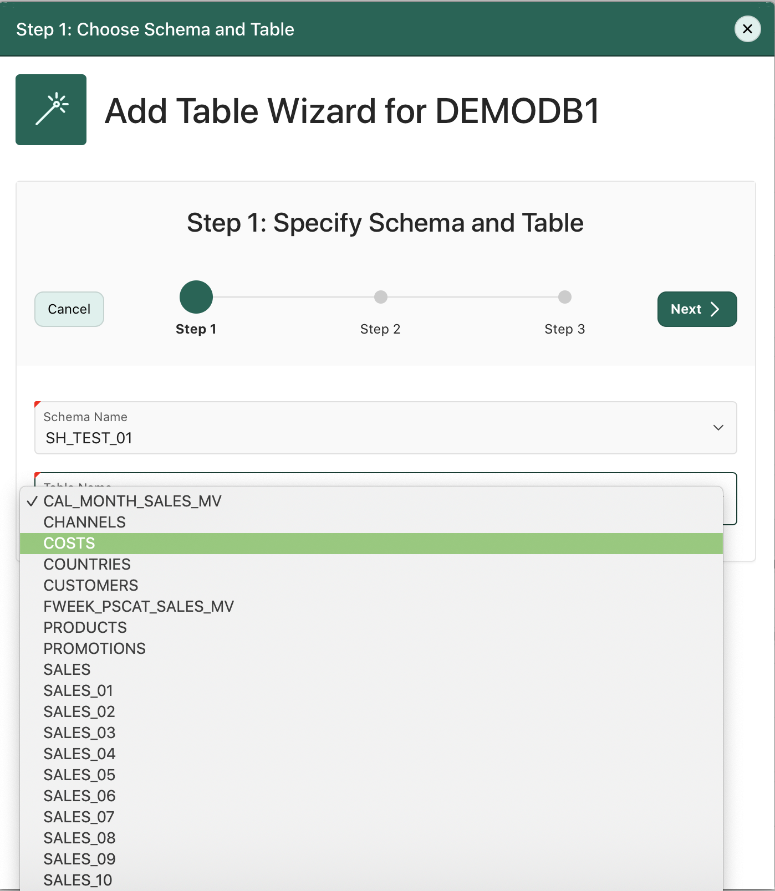

When a database link is allowed, the first screen of the Add Table Wizard will have select lists for the schemas and table names. When next is hit, the partitioning information will be automatically gathered. 

When no connection is allowed, you will need to manually enter the correct schema, table_name and partitioning type. 

The second screen of the Add Table Wizard will be used to specify the Offload and Drop Thresholds for partition tables.

No information is entered for non-partitioned tables.

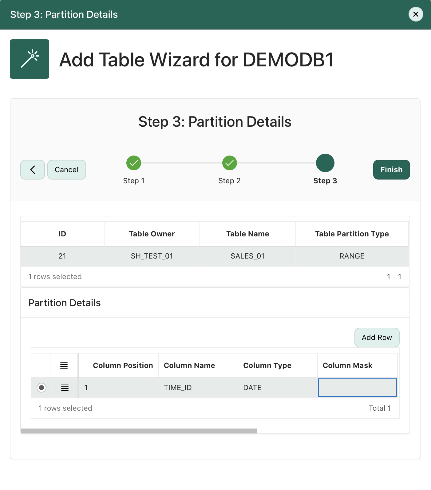

The third screen of the Add Table Wizard is used to specify the partition keys when no connection is allowed. Plus, date masking can be specified for cases where a string or number is used to represent a date.

No information is entered for non-partitioned tables.

# Jobs

## Job Maintenance Main Screen
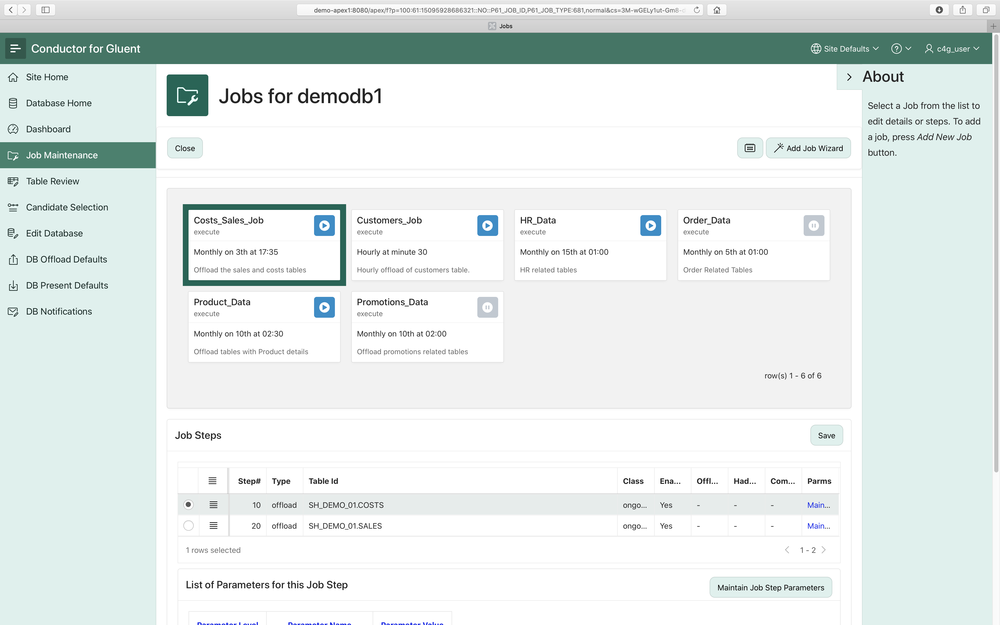

The main screen for job maintenance contains cards, each with a job on it. Jobs can be selected by clicking on the card. Clicking on the current card allows the editing of details about the job. The job steps are editable in this screen. The Job Add Wizard and calendar view are available by pressing the corresponding buttons.

### Jobs - Duplicate Table Job Configuration
When there are duplicate copies of tables that need to be offloaded in multiple schemas. An example of this would be if a company had a schema per client with the same tables under each schema. 

A Duplicate Table Job is added through the <i>Add Job Wizard</i>, however, only step 1 is entered. After completing step 1, you will be taken back to the main job maintenance screen. Once you select the job, you can start adding elements to the configuration. The different types of elements in a configuration are:

<ol>
<li>Duplicate</li>
<ul>
<li>Enter duplicate table details.</li><li>Only a table name is specified (no schema/owner), as there are multiple duplicate tables across the database</li><li> The duplicate element will look for the specified table name across all schemas in the database.</li>
</ul>
<li>Include</li>
<ul>
<li>Enter the details for a specific table that should be included in the job.</li><li>Enter a full table name with owner/schema and table names specified.</li>
</ul>
<li>Exclude</li>
<ul>
<li>Enter the details for a specific table that should be excluded in the job.</li><li>Enter a full table name with owner/schema and table names specified.</li>
</ul>
</ol>

<u>Example</u>

A call center company has one schema for each client that they service through their call center. Under each of those client schemas, they have a CALL_DETAILS table which needs to be offload. In addition, they have a training schema, which has a CALL_DETAILS table that should not be offloaded. The configuration elements for this scenario are:

<ul>
<li>Duplicate, CALL_DETAILS</li>
<li>Exclude, TRAINING.CALL_DETAILS</li>
</ul>

This will result in a job being geneated based on the frequency desired that will have all of the CALL_DETAILS tables except the one from the TRAINING schema. 

## Add Job Wizard

<u>Step 1: Job Name and Type</u>
The job name can be any alpha-numeric characters. The job description is a free form field. The job type is going to be Normal most of the time. Press Next to continue.

Note: A rare case calls for a Duplicate Table job type, when there are duplicate copies of tables that need to be offloaded in multiple schemas. An example of this would be if a company had a schema per client with the same tables under each schema. A Duplicate Table job does not have defined steps. This job type will be covered in a separate section.

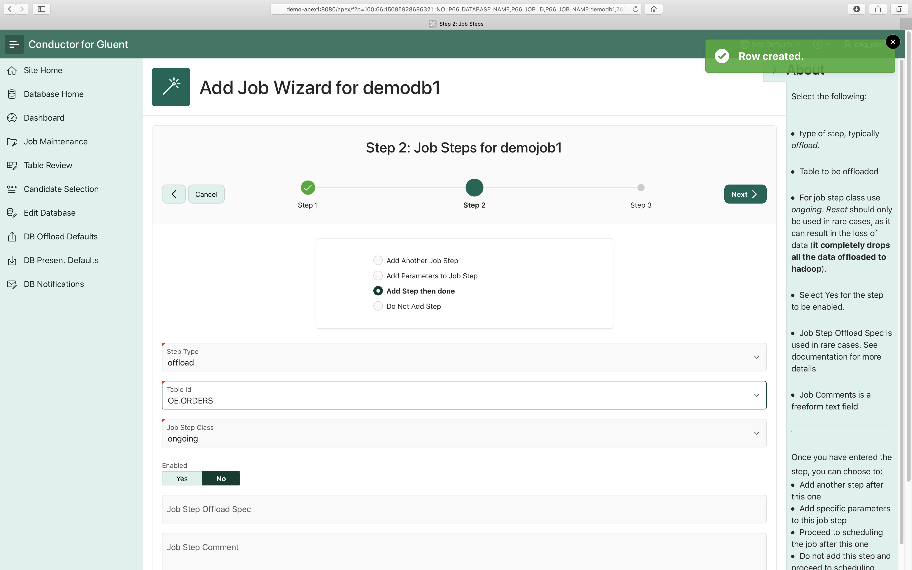

<u>Step 2: Job Steps</u>

Select the step type. Then select the table for the step. Select if the step is enabled or disabled. All steps also have a step comment. Other fields will depend on the step type. Press Next to continue.

<u>Step 3: Job Schedule</u>
Jobs can be scheduled on a Monthly, Weekly, Daily, or Hourly basis. With each, you must select the appropriate details:

- Monthly – day of the month (1-28), hour and minute
- Weekly – day of the week, hour and minute
- Daily – hour and minute Hourly – minute

Only jobs with complete information can be enabled.

## Jobs - Future Calendar

Based on the job scheduling information that has been entered, you can view when jobs will run to help see when there might be conflicts with a maintenance outage or too many jobs running at once.

# Dashboard

The dashboard allows for monitoring of running jobs and shows some statistics on offloaded tables.

<u>Job States</u>

The donut graph shows a summary by state of the jobs. The state pieces can be clicked on to drill down into the details.

<u>Recent Jobs</u>

The 10 most recent jobs. Drilldown to the Current Run of the Job, by clicking on the ID. Also, the job name can be selected to drill down to the job details.

<u>Bytes Comparison</u>

Bytes used in Impala versus the bytes used in Oracle

<u>Space Recovery</u>

In orange is the amount of space that could be recovered if data was truncated/dropped from the offload partitions. In red, we have the amount of data that was truncated/dropped from oracle after offload.

